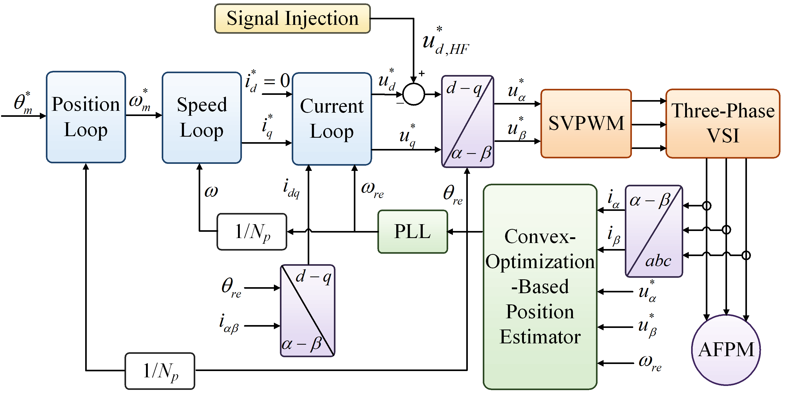
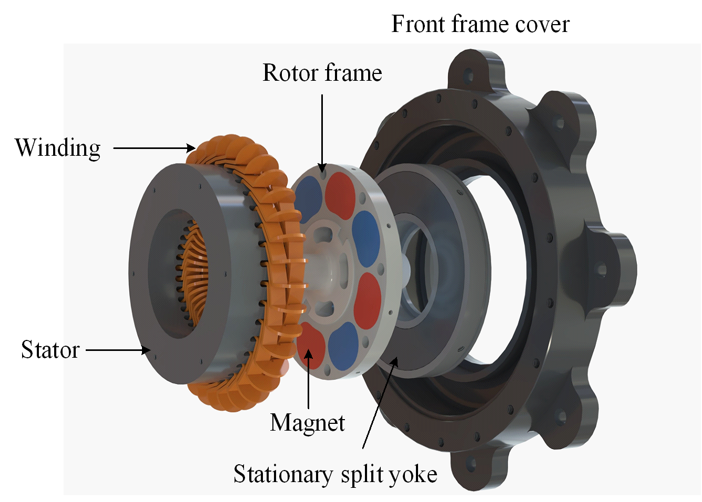

# Full-Speed-Range Sensorless AFPM Operation

This project page presents an experimental study of sensorless operation for a split-yoke axial-flux permanent-magnet (AFPM) machine. The split-yoke structure reduces rotor inertia, but its weak magnetic saliency makes rotor-position estimation difficult at standstill and low speed.

## Approach

The machine uses a nonuniform permanent-magnet/DT4C composite pole. The insert is thinner near the pole center and thicker toward the circumferential sides, reshaping the local permeance distribution so that the q-axis inductance is larger than the d-axis inductance. This machine-side saliency enhancement improves the position-dependent current response without introducing flux barriers into the thin rotor-support frame.

The drive uses a unified convex-optimization-based position estimator across the full speed range. High-frequency signal injection supplies position information near standstill and at low speed; as speed increases, back-EMF becomes increasingly dominant. The same estimator maintains continuous position information through acceleration, deceleration, zero-speed dwell, and direction reversal.

## Experimental highlights

| Condition | Position error | Speed error |
|:---:|:---:|:---:|
| Rated-load operation at +/-10 r/min | 2.9 deg RMS | 3.7 RMS r/min |
| Rated-load operation up to +/-1500 r/min | 3.2 deg RMS | 1.9 RMS r/min |
| Sinusoidal position tracking at 0.1 Hz | 5.2 deg RMS tracking error | 3.0 deg RMS estimation error |

The measured saliency ratio reaches 1.6, with an inductance difference of 0.8 mH. The experiments demonstrate direct sensorless startup, bidirectional low-speed operation, continuous operation up to +/-1500 r/min, and rated-load sinusoidal position tracking.

## Project page

Open the full interactive project page:

<https://7037xxu.github.io/Sensorless-control/>

## Project media

The experiment videos are stored in `assets/videos/`:

- `test-bench.mp4` - test bench inspection
- `10rpm.mp4` - +/-10 r/min operation
- `1500rpm.mp4` - +/-1500 r/min operation
- `sinusoidal-tracking.mp4` - sinusoidal position tracking

The repository contains selected figures and experiment media for technical inspection. The unpublished manuscript is intentionally not included.
